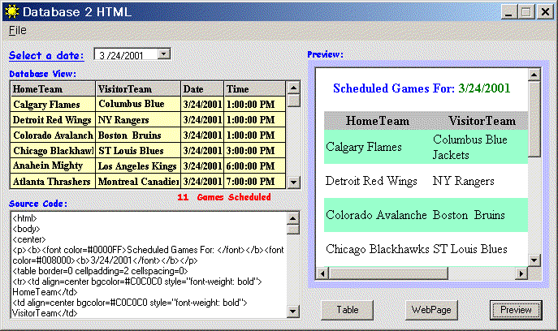



## Database 2 HTML

### Description

This application will take any table from any database, and converts it into a HTML page, with nice looking tables. I have included a database with the entire 2000-2001 hockey season schedule as an example. The user can then view the schedule for any given date and convert it into a HTML page. Good idea if you're a hockey fan and want to update your page with the games scheduled for the day. Please remember to vote for me!
 
### More Info
 

             |
---                |---
**Submitted On**   |2001-03-23 13:11:10
**By**             |[Gnu Kemist](https://github.com/Planet-Source-Code/PSCIndex/blob/master/ByAuthor/gnu-kemist.md)
**Level**          |Advanced
**User Rating**    |4.4 (22 globes from 5 users)
**Compatibility**  |VB 6\.0
**Category**       |[Databases/ Data Access/ DAO/ ADO](https://github.com/Planet-Source-Code/PSCIndex/blob/master/ByCategory/databases-data-access-dao-ado__1-6.md)
**World**          |[Visual Basic](https://github.com/Planet-Source-Code/PSCIndex/blob/master/ByWorld/visual-basic.md)
**Archive File**   |[CODE\_UPLOAD174643232001\.zip](https://github.com/Planet-Source-Code/gnu-kemist-database-2-html__1-21870/archive/master.zip)

